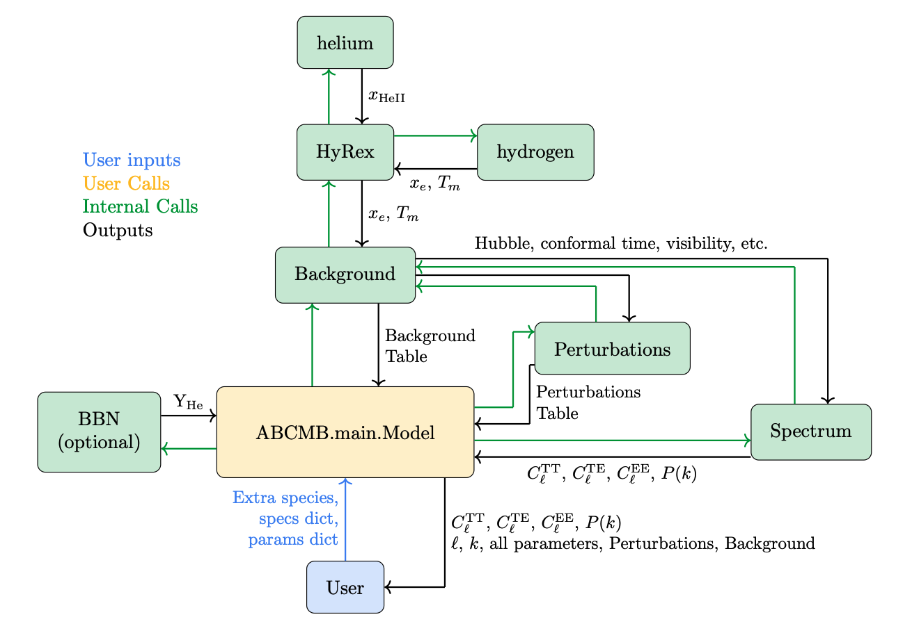

.. ABCMB documentation master file, created by
   sphinx-quickstart on Mon Oct  6 16:03:40 2025.
   You can adapt this file completely to your liking, but it should at least
   contain the root `toctree` directive.

ABCMB documentation
===================

ABCMB is a fully differentiable Boltzmann solver for the CMB.   It computes the matter and CMB power spectra and includes effects like lensing, massive neutrinos, and a state-of-the-art treatment of the physics of recombination through the companion code HyRex.

`HyRex Documentation <https://hyrex.readthedocs.io/en/latest/>`_ is maintained separately. 

Installation
------------
To download and install ABCMB, please visit our `GitHub <https://github.com/TonyZhou729/ABCMB>`_.  There you will find detailed instructions for installing ABCMB and its dependencies.

Module Structure
----------------
The high-level organization of ABCMB is as follows:

In most cases, the user will only need to initialize **ABCMB.main.Model** and call **Model.run_cosmology** explicitly; the other modules will be called by these two top-level modules.

Examples
--------
Three pedagogical example notebooks demonstrating how to use ABCMB are available at our `GitHub <https://github.com/TonyZhou729/ABCMB>`_.  These include Jupyter notebooks demonstrating

- `The basics of using ABCMB <https://github.com/TonyZhou729/ABCMB/blob/main/example_notebooks/ABCMB_basics.ipynb>`_
- `How to add new physics to ABCMB <https://github.com/TonyZhou729/ABCMB/blob/main/example_notebooks/ABCMB_Fluids.ipynb>`_
- `How to combine ABCMB with the BBN code LINX (included) to perform joint CMB+BBN analyses <https://github.com/TonyZhou729/ABCMB/blob/main/example_notebooks/ABCMB_with_LINX.ipynb>`_

.. toctree::
   :maxdepth: 2
   :caption: Contents:

   modules

   

